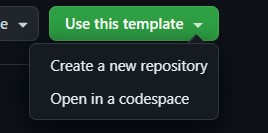

# Basic Express Template 🚀

Gunakan template ini untuk mendevelop Backend menggunakan express. Dalam template
ini sudah disiapkan beberapa library seperti:

- Express: HTTP Server
- Nodemon: Hot reload aplikasi (membuat development menjadi lebih cepat!)
- dotenv: Untuk memuat informasi sensitif pada file `.env`

## Cara menggunakan

1. Pastikan Anda sudah [menginstall Node.js](https://nodejs.org/en)
1. Untuk menggunakan template ini, silahkan untuk menekan tombol `Use this template` atau menekan [tombol ini](https://github.com/new?template_name=simple-express-template&template_owner=kaenova)
   
1. Clone repository yang sudah dibuat.
1. Install library yang dibutuhkan dengan menjalankan command di bawah pada terminal
   `$ npm install`
1. Silahkan copy file `.env.example` ke dalam folder yang sama dan mengganti nama menjadi `.env`. File ini dapat digunakan untuk menyimpan informasi sensitif yang tidak akan terunggah pada Github
1. Jalankan server dengan menjalankan command
   `$ npm run dev`
1. Selamat mengoding :). Anda bisa mulai merubah file `index.js`
